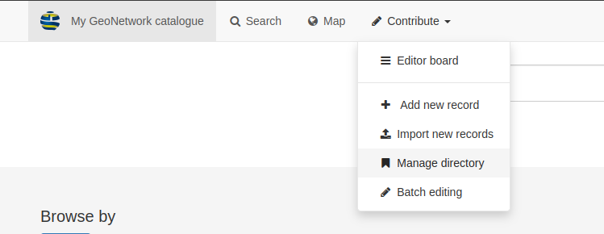

Adding Snippets
===============

This section will explain how to add snippets from https://github.com/AstunTechnology/geonetwork-snippets to a GeoNetwork 4.2.x catalog. 
If you are using your own catalog, make sure that you have reviewed the instructions in `GitHub <https://github.com/AstunTechnology/geonetwork-snippets#generic-snippets-for-geonetwork>__` to check that the additions to the **indexing templates** and the **editor layout** have been included.

Add Snippets to Directory
-------------------------

Login to the catalog as an Administrator and navigate to Contribute > Manage directory.

|menu-image|

To add a snippet to the catalog from the **Manage directory** page:

    * click on the |add-entry-button| button
    * select **Create an entry from scratch**
    * in the textbox presented paste the XML snippet from https://github.com/AstunTechnology/geonetwork-snippets/tree/4.2.x/dataquality as needed
    * click on the |import-directory-button| button

