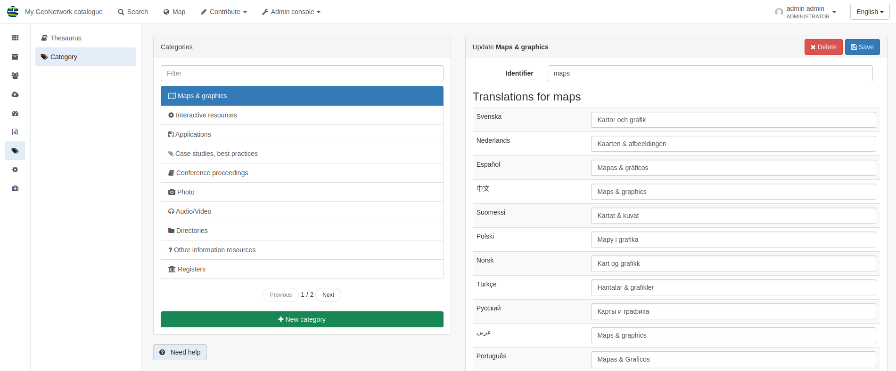

Classification Systems
======================

This section will explain how to add new thesauri to help with UK-specific data sharing as well as how to add custom categories to GeoNetwork.

A **thesaurus** is a **list of concepts** from a specialized field of knowledge. 
In a metadata catalog, concepts from a thesaurus can be assigned to a metadata record (as keywords) as a way of associating it with one or more concepts.

GeoNetwork has a concept of **categories** that can be assigned to metadata documents, but these are **not represented in the metadata**. 
So when the metadata is exported, the category will be lost. 

You can use these categories to separate records into groups, without changing the actual content of the metadata. 
Categories can also be used to filter search results, or limit the output of a custom CSW endpoint.

For further information on managing the classification systems please refer to the 
`official GeoNetwork documentation <https://www.geonetwork-opensource.org/manuals/4.0.x/en/administrator-guide/managing-classification-systems/index.html#>__`.

Thesaurus
---------

Login in as an administrator, and navigate to Admin Console > Classification systems > **Thesaurus**

Thesauri in SKOS format (XML or RDF extensions) can be managed or added here. It is also possible to interrogate the existing thesauri loaded into the catalog.

|Thesaurus page|

It is possible to add additional thesauri by clicking the **+Add thesaurus** button. The options are as follows:

* From registry
* From local file - upload a thesaurus in SKOS format (XML or RDF extensions) from your local hard drive
* From URL - provide a link to a compatible thesaurus online
* New thesaurus - build one from scratch in Geonetwork

For more information on how to create or manage thesauri please refer to the 
`official GeoNetwork documentation <https://www.geonetwork-opensource.org/manuals/4.0.x/en/administrator-guide/managing-classification-systems/managing-thesaurus.html>__`.

Category
--------

Login in as an administrator, and visit Admin Console > Classification systems > **Category**

This page will show a list of the available categories as well as give teh option to add more by clicking on the **+ New category** button.

Each of the labels for the existing categories can be changed by clicking on the relevant category name.
The label translations will open to the right. In order to change the name displayed in the catalog you will need to change the applicable label 
for the language(s) being used- commonly this will be English.

.. important::
    Changing the **Identifier** value of a category will not change the wording associated with it in the catalog.

|Category page|

.. |Thesaurus page| image:: media/thesauruspage.png
    :alt: Thesaurus settings page in GeoNetwork
