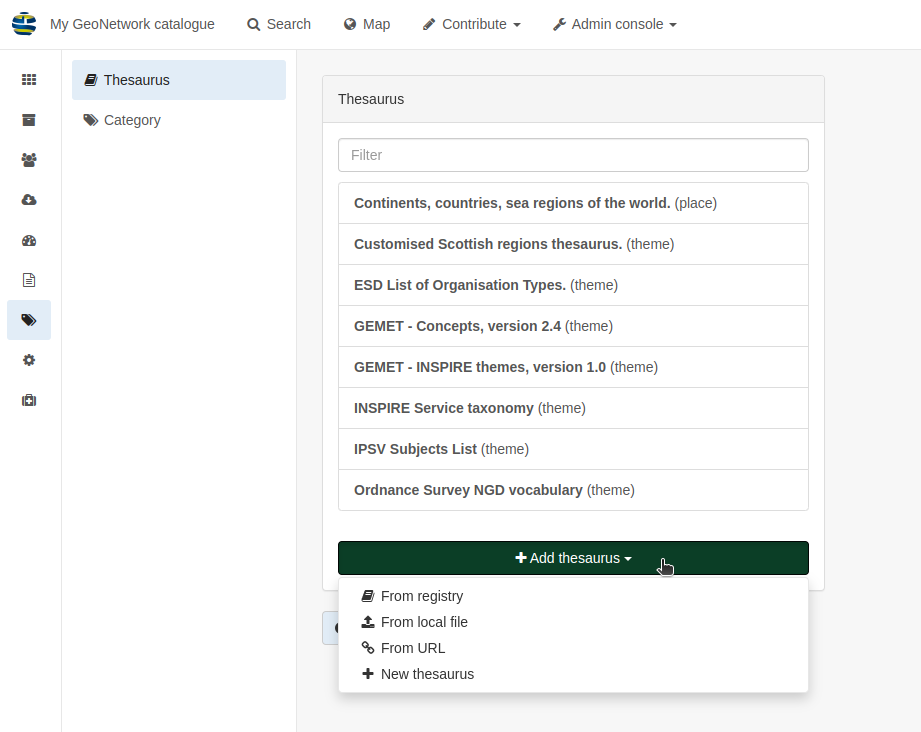

Classification Systems
======================

**Thesaurus**

Login in as an administrator, and visit Admin Console -> Classification systems -> Thesaurus

This page will show a list of the available thesauri as well as give the option to add more by clicking on the **Add thesaurus** dropdown button.

|Thesaurus page|

The options to add a thesauri are as follows:

* From registry
* From local file - upload a thesaurus in SKOS format (XML or RDF extensions) from your local hard drive
* From URL - provide a link to a compatible thesaurus online
* New thesaurus - build one from scratch in Geonetwork

**Category**

Login in as an administrator, and visit Admin Console -> Classification systems -> Category

This page will show a list of the available categories as well as give teh option to add more by clicking on the **+ New category** button.

Each of the labels for the existing categories can be changed by clicking on the relevant category name.
The label translations will open to the right. In order to change the name displayed in the catalog you will need to change the applicable label 
for the language(s) being used- commonly this will be English.

.. important::
    Changing the **Identifier** value of a category will not change the wording associated with it in the catalog.

Further documentation can be found at https://geonetwork-opensource.org/manuals/4.0.x/en/administrator-guide/managing-classification-systems/index.html

