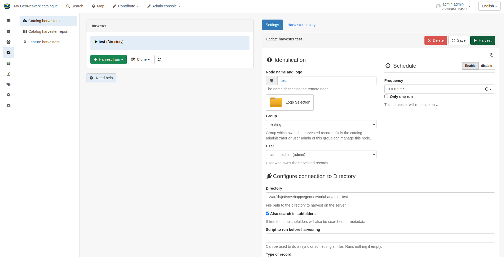
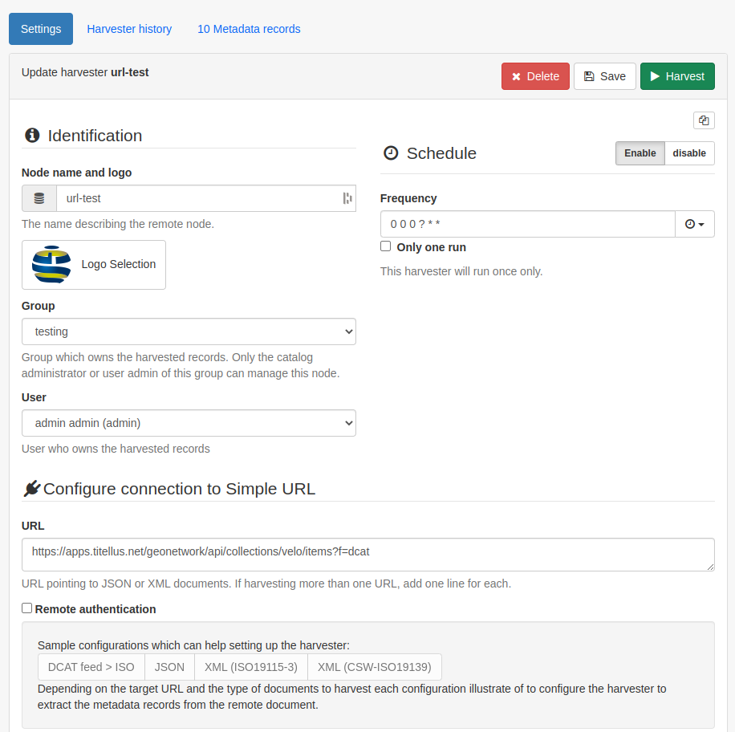
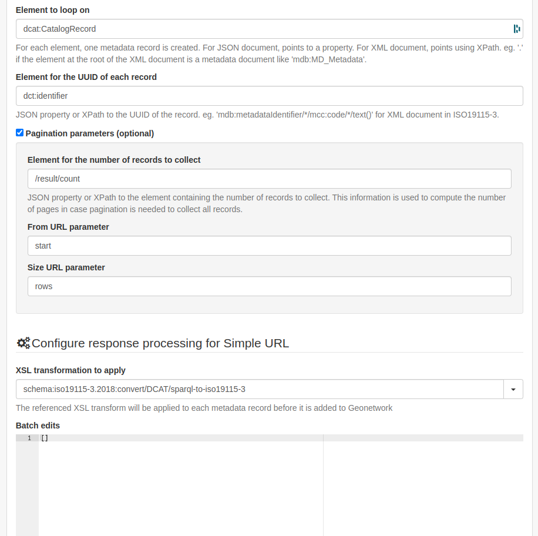
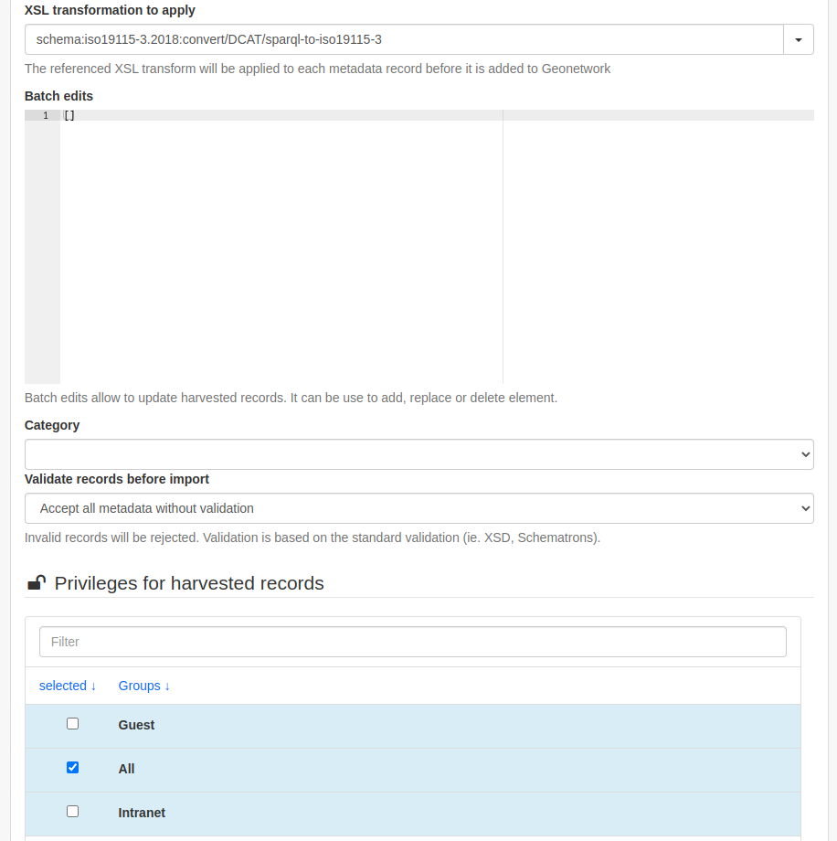
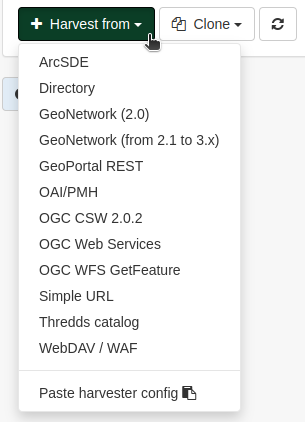
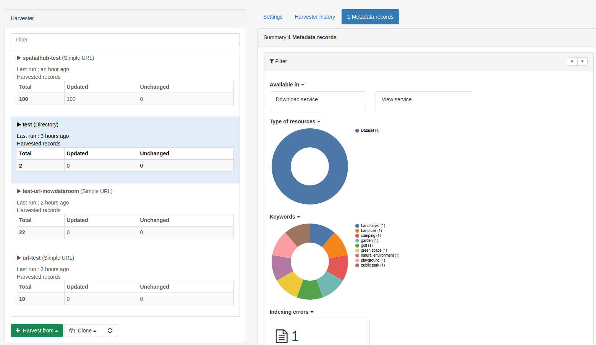

Harvesting
==========

This section outlines the options available for harvesting spatial and non-spatial metadata from various endpoints.

To set up a new harvester in GeoNetwork 4.2.x login as an Administrator and go to Admin console > Harvesting > Catalog harvesters

To add a new harvester click on the **Harvest from** dropdown. The available sources are:

* ArcSDE
* Directory- this will harvest from a directory located on the same server as GeoNetwork
* GeoNetwork (2.0)
* GeoNetwork (from 2.1 to 3.x)
* GeoPortal REST
* OAI/PMH
* OGC CSW 2.0.2
* OGC Web Services
* OGC WFS GetFeature
* Simple URL
* Thredds catalog
* WebDAV/WAF

|Harvester dropdown|

Directory harvesting
--------------------

This option allows users to harvest records from the same server that runs GeoNetwork. 

.. important::
    If you are running GeoNetwork in a dockerised manner you will need to map the local directory to a volume and the path will become the mapped volume path.
    For example if the docker mapping is `./harvester-test:/var/lib/jetty/webapps/geonetwork/harvester-test` then the path that the harvester needs to be pointed at has to be `/var/lib/jetty/webapps/geonetwork/harvester-test` 

    An example setup for harvesting in a dockerised setup
    

The main configuration options for a directory harvest are:
* Node name and logo- this is the name of the harvester and a logo

    * Note: in order to be able to associate a logo to the harvester, it needs to be pre-loaded into the catalog. This can be done in Admin console > Settings > Logo
    
* Group- the group which owns the harvested records
* User- a user can be picked from the list and will be the owner of the records
* Schedule- this feature can be enabled or disabled. If enabled, the user can set a recurring harvest
* Directory- this is the path to the Directory that holds the records
* Also search in subfolders- if ticked this will point the harvester to any existing subfolders too
* Action on UUID collision- this dictates what action will be taken if a UUID already exists in the catalog. This can be set to:

    * Skip record (default)
    * Overwrite record
    * Create new UUID

* Update catalog record only if file was updated (tickbox)
* Keep catalog record even if deleted at source (tickbox)
* Validate records before import- the default option is to accept all metadata without validation
* XSL transformation to apply
* Batch edits
* Category- the category to be allocated to the harvested records
* Group privileges for the harvested records

.. warning::
    This method has been tested in GeoNetwork 4.2.x and it successfuly harvested .ZIP and .XML records, however only .XML records are shown and accounted for in the **Metadata records** tab on the harvester page.

|Harvester records discrepancy|

Simple URL harvesting
---------------------

This option allows users to harvest records from various enpoints like DCAT/rdf or JSON (ESRI).

.. important::
    You'll need to adapt the config to match the exact feed that you're trying to harvest- so manually look at it to identify the overarching dataset and identifier elements before continuing.

The main configuration options to set are:
* Node name and logo- this is the name of the harvester and a logo

    * Note: in order to be able to associate a logo to the harvester, it needs to be pre-loaded into the catalog. This can be done in Admin console > Settings > Logo

* Group- the group which owns the harvested records
* User- a user can be picked from the list and will be the owner of the records
* Schedule- this feature can be enabled or disabled. If enabled, the user can set a recurring harvest
* URL- path to endpoint for whole catalog (e.g. `https://apps.titellus.net/geonetwork/api/collections/velo/items?f=dcat`)
* Element to loop on- the XPath for the element that represents a dataset (e.g. `dcat:CatalogRecord`)
* Element for the UUID of each record- the element inside the dataset loop that should be used as the unique identifier (e.g. `./dct:identifier`)
* XSL transformation to apply- these are now done on a per schema basis, so find the correct file and add it as follows: `schema:{schemaname}:convert:{optional folder inside the schema's convert folder}/{filename without the xsl suffix}` (e.g. `schema:iso19115-3.2018:convert/DCAT/sparql-to-iso19115-3`)
* Batch edits
* Category- the category to be allocated to the harvested records
* Group privileges for the harvested records

    The top section of the configuration for an example Simple URL harvester

    The middle section of the configuration for an example Simple URL harvester

    The bottom section of the configuration for an example Simple URL harvester

