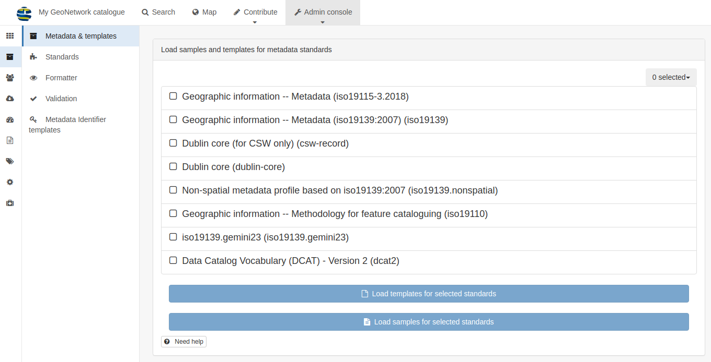

Requirements
============

.. IMPORTANT::
	To follow this guidance you will need to have an installation of GeoNetwork Open Source, with version 3.10.x. It will not work with earlier versions, and has not been extensively tested yet with GeoNetwork version 4.0.x.

For instructions on installing GeoNetwork, and guidance on getting started, please see the official documentation at `https://www.geonetwork-opensource.org/manuals/trunk/en/install-guide/index.html <https://www.geonetwork-opensource.org/manuals/trunk/en/install-guide/index.html>`__.

You will also need to install the plugins for `Gemini 2.3  <https://github.com/AstunTechnology/iso19139.gemini23>`__ (for spatial data), and `iso19139.nonspatial <https://github.com/AstunTechnology/iso19139.nonspatial>`__ (for non-spatial data). Additionally, you can install the plugin for metadata in `DCAT-AP v2 <https://github.com/AstunTechnology/dcat2>`__ format. Follow the links to each repository for instructions on how to install. Note that you will need access to the file system on the host computer to do this.

Once you've restarted GeoNetwork, you can check that the metadata profiles have loaded correctly by logging in as an Administrator and going to the admin console -> metadata and templates page. 

The list should include the following additional entries (alongside the pre-loaded ones):

* Non-spatial metadata profile based on iso19139:2007
* iso19139.gemini23
* Data Catalog Vocabulary (DCAT) - Version 2

|configuration_metadataandtemplates|

Click the grey dropdown box marked **0 selected** and choose **All**, then click the blue buttons **Load templates for selected standards** and **Load samples for selected standards**.

