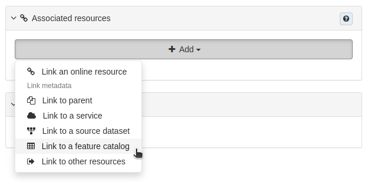
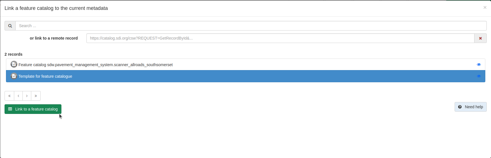
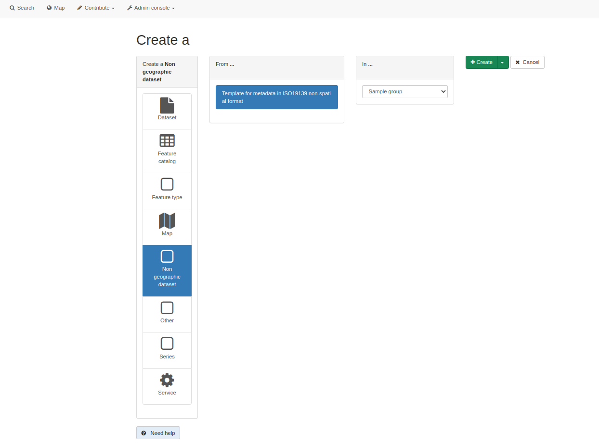
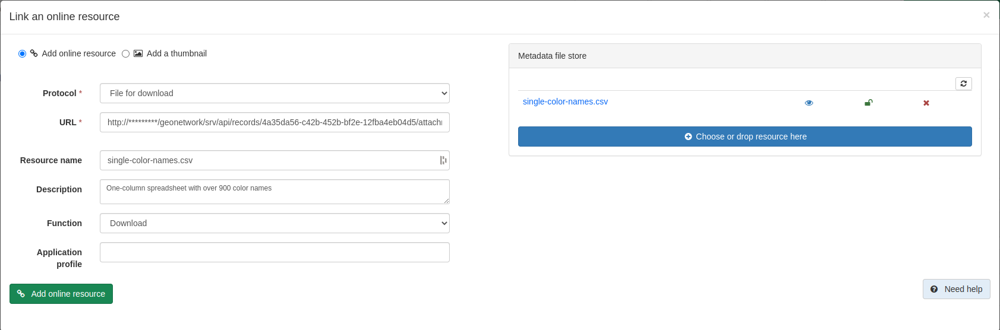

Workflow
========

This is a workflow for using GeoNetwork to meet the Government's `guidance on sharing tabular data <https://www.gov.uk/guidance/record-information-about-data-sets-you-share-with-others>`__. 

Choosing a data format
----------------------

We recommend using CSV for your non-spatial tabular datasets to meet `Government data sharing guidance <https://www.gov.uk/guidance/publishing-your-tabular-data>`__ but json may be a more suitable format if the data is more complex. See `Government API guidelines <https://www.gov.uk/guidance/gds-api-technical-and-data-standards#use-json>`__ for information on good practice for json.

If you are more accustomed to sharing data as an Excel spreadsheet, we would definitely recommend that you convert to CSV as above for data sharing to avoid security risks from macros, or problems arising from Excel's auto-formatting functionality.

Formatting your data as a CSV
-----------------------------

The Government's guidance on a `tabular data standard  <https://www.gov.uk/government/publications/recommended-open-standards-for-government/tabular-data-standard>`__ recommends that you share non-spatial metadata in CSV format, meeting the following specifications:

 * 0 or 1 header rows (preferrably 1)
 * After the header row, each row should represent a record (eg no blank lines, totals or so on)
 * Fields are separated by commas, with text optionally delimited with double quotes
 * All rows have the same number of fields
 * Line-breaks use windows style "\\r\\n"
 * Use UTF8 for encoding
 * No Byte Order Mark (see the link above for more information)

Creating a metadata record
--------------------------

Log into GeoNetwork as a user with at least Editor priviliges or higher, and go to the Contribute Tab. Choose **Add a new record** and then select **Non geographic dataset** from the list on the left. Assuming you have followed the `configuration instructions <configuration.html>`__ you should be offered the template **Template for metadata in ISO19139 non-spatial format**. Select that by clicking it, then choose the group you wish to create the record in, and finally click the green **+Create** button.

|Create a non-spatial record|

* Fill in all the fields shown in the default non-spatial view

Uploading your dataset
----------------------

In your non-spatial record, use the **Associated resourcses** wizard in the top right and click **+Add**. From the list of options, choose **Link an online resource**. 

In the **Metadata file store** section to the right, click the **+Choose or drop resource here** button to navigate to your CSV file. 
Once it is uploaded, select it from the list so that some of the options on the left (like the URL and Resource name) are auto-completed for you.

Fill in a description, and choose **Download** from the list of functions. You can leave the **Application profile** section blank. 

Finally, click the green **Add online resource** button.

|Attach file to record|

.. important::
	GeoNetwork will check that the URL to the CSV file is reachable, and will show you an error message at the bottom if it is not. In that case, check the URL is correct.

Creating a Feature Catalog record from your dataset
---------------------------------------------------

A feature catalog describes the data model of the dataset with the list of tables, attributes, definitions, list of values, etc.

Feature catalogs can be described:
* as a document (e.g. PDF or CSV) and linked to the metadata record (see `Linking a document <https://geonetwork-opensource.org/manuals/4.0.x/en/user-guide/associating-resources/linking-online-resources.html#linking-a-document>`__ )
* as a record and described using the ISO19115-3 standard (replacing ISO19110)

**Link to a Feature Catalog record**

* Log into GeoNetwork as a user with at least Editor priviliges or higher and find the metadata record for your dataset
* Start an editing session of the record in Default view
* On the right-hand side click the **Add** button of the **Associated resources** panel
* Choose **Link to a feature catalog** from the dropdown menu
* In the pop-up window that opens, use the search bar at the top to locate an existing feature catalog or insert a link to a remote catalog
* Click on the **Link to a feature catalog** button to link the resources

	Associated resources panel showing the dropdown menu options

	"Link a feature catalog" pop-up window

If the steps above have been successful you should see your linked Feature Catalog in the **Associated resources** panel on the right-hand side. Remember to save the changes before closing the window using the buttons at the top of the page.

|Linked feature catalog|

.. |Associated resources panel| 

.. |Linked feature catalog| figure:: media/linkedfeaturecat.png
	:alt: Associated resources panel showing a linked feature catalog

	Associated resources panel showing a linked feature catalog